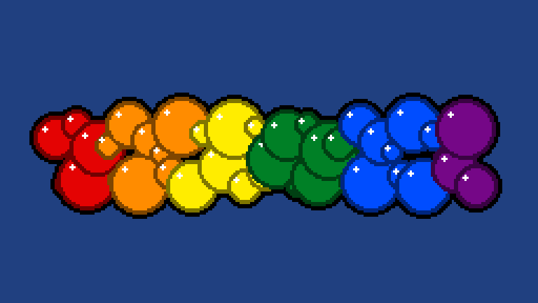

# Pride Bubbles


A quick little bubble images in the [Pride Flag](https://en.wikipedia.org/wiki/Pride_flag) [colours](https://www.sexualdiversity.org/edu/flags/1051.php)


```

poke(0x3fc0+0,32)
poke(0x3fc0+1,64)
poke(0x3fc0+2,128)

poke(0x3fc0+3,0)
poke(0x3fc0+4,0)
poke(0x3fc0+5,0)

poke(0x3fc0+42,255)
poke(0x3fc0+43,255)
poke(0x3fc0+44,255)

colours = {}
colours[1] = {r=228, g=3,   b=3}
colours[2] = {r=255, g=140, b= 0}
colours[3] = {r=255, g=237, b= 0}
colours[4] = {r=0  , g=128, b= 38}
colours[5] = {r=0  , g=77 , b= 255}
colours[6] = {r=117, g=7  , b= 135}

for i=1, #colours do
	r=colours[i].r
	g=colours[i].g
	b=colours[i].b
	regnumber = 1 + i-1
	reg = 0x3fc0+regnumber*6
	for j=1,2 do
		invj = 3-j 
		poke(reg+0-3+j*3,r/invj)
		poke(reg+1-3+j*3,g/invj)
		poke(reg+2-3+j*3,b/invj)
	end
end

function TIC()
 cls(0)
  
 pts={}
 
 for i=1,41 do
  yoffset = math.sin(i*10)*15
  rsize = math.sin(-11+i*30)*5
 	pts[#pts+1] ={x=13+i*5,y=70+yoffset,r=10+rsize}
	end
 
 for i=1,#pts do 	
		circ(pts[i].x,pts[i].y,pts[i].r+2,1)
	end	

 for i=1,#pts do
		offset = pts[i].x//40
		c = 2 + offset * 2  
		
		for j=0,1 do
			circ(pts[i].x,pts[i].y,pts[i].r-j*2,c+j)
		end
		
		w = (pts[i].r-1*2)/2
		circ(pts[i].x-w,pts[i].y-w,1,14)
	end	
end    
```